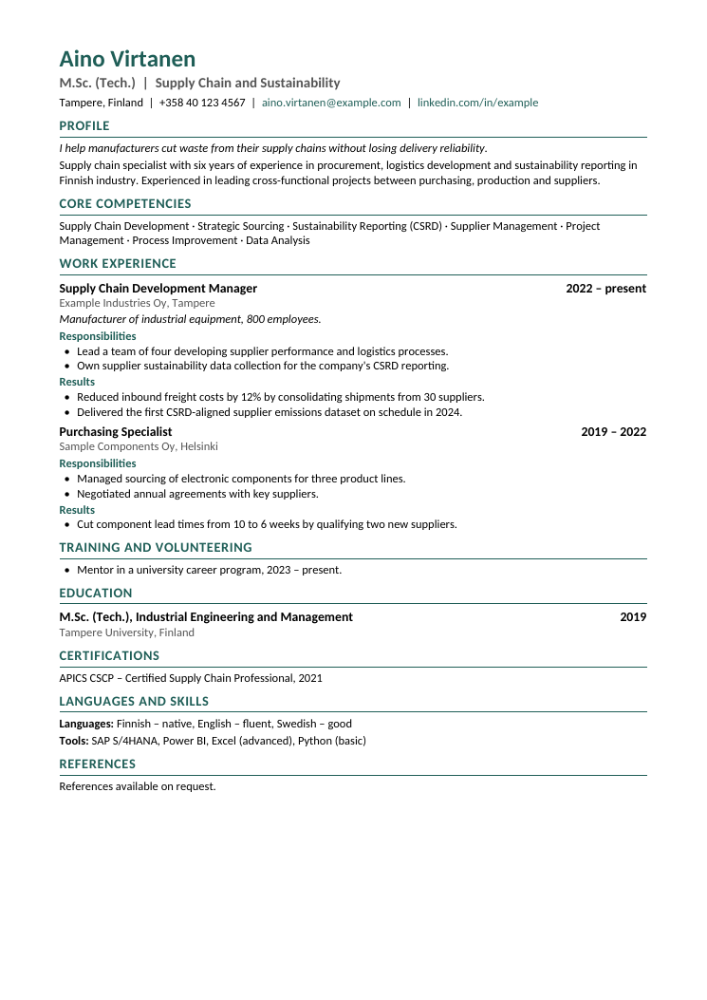

# Finland CV skill

A Claude skill that builds a CV for the Finnish job market: an editable Word file plus a PDF, 1-2 A4 pages, with **Responsibilities** and **Results** under each role. It follows the advice of Finnish career services and stays readable by the recruitment systems Finnish employers use (Laura, Sympa, TalentAdore, Workday and others).



*Example with made-up data ([PDF](finland-cv/examples/example_cv.pdf), [input JSON](finland-cv/examples/example_cv.json)).*

## What it does

- Turns your existing CV (.docx or .pdf) or your notes into a clean, single-column CV
- Keeps your own wording and never invents numbers, employers or dates
- Puts your name alone on the first line, so screening tools can read it
- Leaves out date of birth, ID numbers and photo by default
- Lists languages with clear levels
- Switches all headings to Finnish with one setting (`"lang": "fi"`)
- Checks the result: page count, text order as a parser sees it, and a visual look at every page
- Ends by asking you for the numbers (team size, budget, %, EUR) that CV checkers look for

## Install

**Claude (claude.ai / desktop):** zip the `finland-cv` folder and upload it in Claude's skills settings, or give Claude the link to this repository and ask it to install the skill.

**Claude Code:** copy the folder into your skills directory:

```bash
git clone https://github.com/MohaAya/CVFinLandATS.git
cp -r CVFinLandATS/finland-cv ~/.claude/skills/
```

Then ask: *"Make my CV for Finnish jobs"* and attach your current CV.

## Run the script yourself

Requires Node.js with the `docx` package, and LibreOffice for the PDF:

```bash
npm install docx
node finland-cv/scripts/build_cv.js finland-cv/examples/example_cv.json My_CV.docx
soffice --headless --convert-to pdf My_CV.docx
```

Edit `example_cv.json` with your own details. The schema is documented in [`finland-cv/SKILL.md`](finland-cv/SKILL.md).

## Sources for the Finnish CV rules

- [Talent Hub Eastern Finland: Quick Tips to Finnish Your CV (2026)](https://www.talenthubeasternfinland.fi/wp-content/uploads/sites/157/2026/03/Talent-Hub-FI-EN-Quick-Tips-to-Finnish-Your-CV.pdf)
- [Academic Work: Recruiter's tips for a good CV](https://www.academicwork.fi/en/articles/job-search/tips-for-a-good-cv)
- [Metropolia: How to create an effective CV for the Finnish job market](https://opiskelijan.metropolia.fi/en/working-life/career-guide/tips-and-tools-for-job-searching/how-to-create-an-effective-cv-for-finnish-job-market)

## License

MIT
